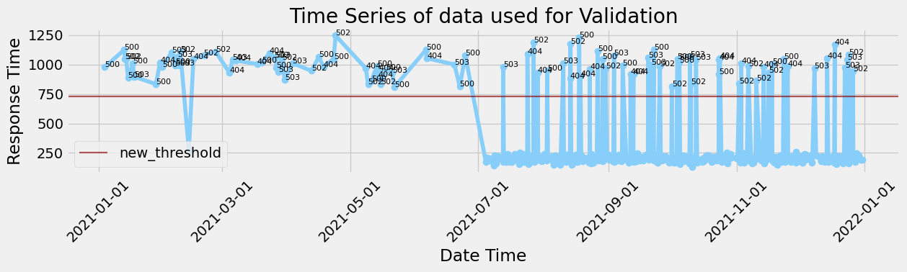

# シナリオ案

- 問題：分析実装後のアラームの再設定検討や仕組みを理解するための時間が増え作業負荷が増大したように感じる
- 課題：アラームに対して次のアプローチを考えることが(時間がかかったり技術が無く)難しい

- 事前に入力として現在設定している閾値を持っていることとする。

- アラーム発生からそれ以前のデータを収集し、データ分布や時系列での状況を可視化+GPTでデータの概要を生成する。(○○に発生したアラームではHTTPステータス○○のエラーが発生し、処理が正常終了しなかったためアラームが発生しました。このアラームの直前には○○が起きており、このアラームより前のデータ○○個のデータをみると...)
- アラーム発生からそれ以前のデータを使い簡易的な分析を実施、新しい閾値の提案とその場合データはどのように読み取ることができるようになるのかを現状と比較しての概要説明をGPTモデルで生成する
    - 閾値設定用の分析は、取得データの分布95%のデータを正常とし、5%を異常とする形でHold Out法で教師なしで分析を実施する。時系列を考慮したARIMAでの分析もしたいな

あたかもGPTモデルがデータの説明・可視化、閾値の再設定案の提示まで自動でやってくれる感じにしたい<br>
入出力のあいまいさを許しつつ出力の曖昧さはルールで補う漢字で

- アラームに対して次のアプローチを提示するためアラーム発報時のデータの重要度の高いトークンをいくつか抽出(HTTPステータスが抽出されるイメージ)し、ReActでDBまたはネットからトークンに関連する情報をもとに次のアプローチを生成する


```python
from contextlib import contextmanager
from time import time

class Timer:
    """処理時間を表示するクラス
    with Timer(prefix=f'pred cv={i}'):
        y_pred_i = predict(model, loader=test_loader)
    
    with Timer(prefix='fit fold={} '.format(i)):
        clf.fit(x_train, y_train, 
                eval_set=[(x_valid, y_valid)],  
                early_stopping_rounds=100,
                verbose=verbose)

    with Timer(prefix='fit fold={} '.format(i), verbose=500):
        clf.fit(x_train, y_train, 
                eval_set=[(x_valid, y_valid)],  
                early_stopping_rounds=100,
                verbose=verbose)
    """
    def __init__(self, logger=None, format_str='{:.3f}[s]', prefix=None, suffix=None, sep=' ', verbose=0):

        if prefix: format_str = str(prefix) + sep + format_str
        if suffix: format_str = format_str + sep + str(suffix)
        self.format_str = format_str
        self.logger = logger
        self.start = None
        self.end = None
        self.verbose = verbose

    @property
    def duration(self):
        if self.end is None:
            return 0
        return self.end - self.start

    def __enter__(self):
        self.start = time()

    def __exit__(self, exc_type, exc_val, exc_tb):
        self.end = time()
        out_str = self.format_str.format(self.duration)
        if self.logger:
            self.logger.info(out_str)
        else:
            print(out_str)
```


```python
import gc
gc.collect()
```


    257


```python
# アラーム前まで仮定で設定している閾値(現在設定中の閾値)
threshold = 1000
```

## 疑似データの作成


```python
import pandas as pd
import numpy as np
import random
from datetime import datetime, timedelta

def seed(seed=42):
    np.random.seed(seed)
    random.seed(seed)
seed(42)

# データ件数と異常値の数を10:1になるように設定
data_size = 1000
num_anomalies = 100

# 日付インデックスを生成
date_rng = pd.date_range(start='2021-01-01', end='2021-12-31', freq='S')
date_rng = np.random.choice(date_rng, data_size, replace=False)
date_rng.sort()

# レスポンスタイムの正規分布に従ったランダムデータを生成
response_time_data = np.random.normal(loc=200, scale=20, size=data_size)

# ステータスコードのリストを作成
status_codes = ['200', '201', '204', '400', '401', '403', '404', '500', '502', '503']
status_code_probs = [0.6, 0.1, 0.05, 0.1, 0.02, 0.02, 0.08, 0.01, 0.01, 0.01]
status_code_data = np.random.choice(status_codes, size=data_size, p=status_code_probs)

# 異常値をランダムに挿入
anomaly_indices = random.sample(range(data_size), num_anomalies)
for idx in anomaly_indices:
    response_time_data[idx] = np.random.normal(loc=1000, scale=100)
    status_code_data[idx] = random.choice(['404', '500', '502', '503'])

# データフレームを作成
# df = pd.DataFrame(data={'response_time': response_time_data, 'status_code': status_code_data}, index=date_rng)
df = pd.DataFrame(data={'date_time': date_rng, 'response_time': response_time_data, 'status_code': status_code_data})

```


```python
df.head()
```


<div>
<style scoped>
    .dataframe tbody tr th:only-of-type {
        vertical-align: middle;
    }

    .dataframe tbody tr th {
        vertical-align: top;
    }

    .dataframe thead th {
        text-align: right;
    }
</style>
<table border="1" class="dataframe">
  <thead>
    <tr style="text-align: right;">
      <th></th>
      <th>date_time</th>
      <th>response_time</th>
      <th>status_code</th>
    </tr>
  </thead>
  <tbody>
    <tr>
      <th>0</th>
      <td>2021-01-01 01:13:30</td>
      <td>235.196490</td>
      <td>201</td>
    </tr>
    <tr>
      <th>1</th>
      <td>2021-01-01 14:29:43</td>
      <td>216.519988</td>
      <td>200</td>
    </tr>
    <tr>
      <th>2</th>
      <td>2021-01-02 03:15:21</td>
      <td>188.627762</td>
      <td>200</td>
    </tr>
    <tr>
      <th>3</th>
      <td>2021-01-02 10:17:39</td>
      <td>181.143408</td>
      <td>200</td>
    </tr>
    <tr>
      <th>4</th>
      <td>2021-01-02 16:28:55</td>
      <td>189.266348</td>
      <td>400</td>
    </tr>
  </tbody>
</table>
</div>


```python
import matplotlib.pyplot as plt
import seaborn as sns
plt.style.use('fivethirtyeight')

def plot_count(feature, title, df, size=1):
    """クラス/特徴量をプロットする
    Pram:
        feature : 分析するカラム
        title : グラフタイトル
        df : プロットするデータフレーム
        size : デフォルト 1.
    """
    f, ax = plt.subplots(1,1, figsize=(4*size,4))
    total = float(len(df))
    # 最大20カラムをヒストグラムで表示
#     g = sns.countplot(data=df, x = feature, order = df[feature].value_counts().index[:20], palette='Set3')
    g = sns.countplot(data=df, y = feature, order = df[feature].value_counts().index[:10], palette='Set3')
    g.set_title("Number and percentage of {}".format(title))
#     if(size > 2):
        # サイズ2以上の時、行名を90°回転し、表示
#         plt.xticks(rotation=90, size=8)
    # データ比率の表示
    for p in ax.patches:
        height = p.get_height()
        width = p.get_width()
#         ax.text(p.get_x()+p.get_width()/2.,
#                 height + 3,
#                 '{:1.2f}%'.format(100*height/total),
#                 ha="center")
        ax.text(width + 40,
                p.get_y()+p.get_height()+.025/2.,
                '{:1.2f}%'.format(100*width/total),
                ha="right") 
    plt.tight_layout()
    plt.show()
```


```python
# 全データのstatus_codeの比率を確認する
plot_count(feature='status_code', title='status_code', df=df, size=3.5)
```


    

    


```python
df['status_code'].value_counts()
```


    status_code
    200    544
    404     96
    201     86
    400     84
    204     52
    500     39
    503     36
    502     33
    403     20
    401     10
    Name: count, dtype: int64


```python
print(f'Number of all data: {df.shape[0]}')
```

    Number of all data: 1000


```python
import matplotlib.dates as mdates

# 時系列可視化
def time_prot(df, threshold=0, lebel_name='threshold', color='darkblue', title='Response Time Time Series'):
    fig, ax = plt.subplots(1,1, figsize=(4*3.2,4))
    ax.plot(df['date_time'], df['response_time'], marker='o', color='lightskyblue')


    # response_timeが800以上のデータのstatus_codeを表示
    for index, row in df.iterrows():
        if threshold != 0:
            if row['response_time'] >= threshold:
                # ax.text(row['date_time'], row['response_time'], str(row['status_code']), backgroundcolor="lightyellow")
                ax.text(row['date_time'], row['response_time'], str(row['status_code']), size=8)

    # x軸の設定
    # ax.xaxis.set_major_formatter(mdates.DateFormatter('%Y-%m-%d %H:%M'))
    ax.xaxis.set_major_formatter(mdates.DateFormatter('%Y-%m-%d'))
    plt.xticks(rotation=45)

    # 閾値の表示
    if threshold != 0:
        ax.axhline(y=threshold, c=color, linewidth = 1.6, alpha=0.64, label=lebel_name)
        # 凡例の設定
        # ax.legend(loc='upper left')
        ax.legend()

    # タイトルとラベルの設定
    plt.title(title)
    plt.xlabel('Date Time')
    plt.ylabel('Response Time')
    plt.tight_layout()
    plt.show()
```


```python
time_prot(df, threshold)
```


    

    


```python
df[df['response_time'] >= threshold]
```


<div>
<style scoped>
    .dataframe tbody tr th:only-of-type {
        vertical-align: middle;
    }

    .dataframe tbody tr th {
        vertical-align: top;
    }

    .dataframe thead th {
        text-align: right;
    }
</style>
<table border="1" class="dataframe">
  <thead>
    <tr style="text-align: right;">
      <th></th>
      <th>date_time</th>
      <th>response_time</th>
      <th>status_code</th>
    </tr>
  </thead>
  <tbody>
    <tr>
      <th>25</th>
      <td>2021-01-13 05:21:11</td>
      <td>1124.366513</td>
      <td>500</td>
    </tr>
    <tr>
      <th>27</th>
      <td>2021-01-13 15:37:20</td>
      <td>1045.896602</td>
      <td>502</td>
    </tr>
    <tr>
      <th>30</th>
      <td>2021-01-14 04:53:20</td>
      <td>1049.931362</td>
      <td>502</td>
    </tr>
    <tr>
      <th>44</th>
      <td>2021-01-17 09:57:30</td>
      <td>1011.391710</td>
      <td>500</td>
    </tr>
    <tr>
      <th>80</th>
      <td>2021-01-30 08:08:47</td>
      <td>1016.802237</td>
      <td>404</td>
    </tr>
    <tr>
      <th>89</th>
      <td>2021-02-04 21:53:57</td>
      <td>1104.939942</td>
      <td>503</td>
    </tr>
    <tr>
      <th>95</th>
      <td>2021-02-06 18:43:58</td>
      <td>1003.455028</td>
      <td>500</td>
    </tr>
    <tr>
      <th>99</th>
      <td>2021-02-07 16:04:52</td>
      <td>1068.312356</td>
      <td>503</td>
    </tr>
    <tr>
      <th>104</th>
      <td>2021-02-09 01:14:46</td>
      <td>1107.179114</td>
      <td>502</td>
    </tr>
    <tr>
      <th>114</th>
      <td>2021-02-15 05:49:43</td>
      <td>1048.247816</td>
      <td>404</td>
    </tr>
    <tr>
      <th>127</th>
      <td>2021-02-20 03:53:35</td>
      <td>1079.416588</td>
      <td>502</td>
    </tr>
    <tr>
      <th>142</th>
      <td>2021-02-25 19:08:39</td>
      <td>1110.090483</td>
      <td>502</td>
    </tr>
    <tr>
      <th>163</th>
      <td>2021-03-05 21:08:30</td>
      <td>1040.464885</td>
      <td>503</td>
    </tr>
    <tr>
      <th>166</th>
      <td>2021-03-07 12:10:02</td>
      <td>1034.677382</td>
      <td>404</td>
    </tr>
    <tr>
      <th>196</th>
      <td>2021-03-17 13:34:40</td>
      <td>1004.078148</td>
      <td>404</td>
    </tr>
    <tr>
      <th>203</th>
      <td>2021-03-19 21:00:56</td>
      <td>1015.805468</td>
      <td>500</td>
    </tr>
    <tr>
      <th>214</th>
      <td>2021-03-23 10:01:46</td>
      <td>1094.918171</td>
      <td>404</td>
    </tr>
    <tr>
      <th>220</th>
      <td>2021-03-25 19:57:01</td>
      <td>1061.683363</td>
      <td>502</td>
    </tr>
    <tr>
      <th>223</th>
      <td>2021-03-26 08:06:39</td>
      <td>1057.038911</td>
      <td>503</td>
    </tr>
    <tr>
      <th>233</th>
      <td>2021-03-29 12:20:14</td>
      <td>1040.659326</td>
      <td>502</td>
    </tr>
    <tr>
      <th>250</th>
      <td>2021-04-03 09:20:39</td>
      <td>1012.544021</td>
      <td>503</td>
    </tr>
    <tr>
      <th>281</th>
      <td>2021-04-15 22:55:53</td>
      <td>1064.824344</td>
      <td>500</td>
    </tr>
    <tr>
      <th>296</th>
      <td>2021-04-23 01:10:46</td>
      <td>1050.135021</td>
      <td>500</td>
    </tr>
    <tr>
      <th>300</th>
      <td>2021-04-23 23:41:40</td>
      <td>1246.258677</td>
      <td>502</td>
    </tr>
    <tr>
      <th>429</th>
      <td>2021-06-06 01:38:11</td>
      <td>1125.659602</td>
      <td>500</td>
    </tr>
    <tr>
      <th>432</th>
      <td>2021-06-06 11:54:03</td>
      <td>1053.749146</td>
      <td>404</td>
    </tr>
    <tr>
      <th>459</th>
      <td>2021-06-19 14:20:14</td>
      <td>1000.740886</td>
      <td>503</td>
    </tr>
    <tr>
      <th>470</th>
      <td>2021-06-24 18:21:28</td>
      <td>1076.874877</td>
      <td>500</td>
    </tr>
    <tr>
      <th>549</th>
      <td>2021-07-24 08:44:28</td>
      <td>1090.182137</td>
      <td>404</td>
    </tr>
    <tr>
      <th>558</th>
      <td>2021-07-27 07:48:37</td>
      <td>1184.970069</td>
      <td>502</td>
    </tr>
    <tr>
      <th>591</th>
      <td>2021-08-10 11:30:35</td>
      <td>1013.334766</td>
      <td>503</td>
    </tr>
    <tr>
      <th>604</th>
      <td>2021-08-13 21:18:14</td>
      <td>1173.805152</td>
      <td>502</td>
    </tr>
    <tr>
      <th>616</th>
      <td>2021-08-18 01:01:21</td>
      <td>1228.750114</td>
      <td>500</td>
    </tr>
    <tr>
      <th>643</th>
      <td>2021-08-26 20:19:23</td>
      <td>1116.461138</td>
      <td>500</td>
    </tr>
    <tr>
      <th>650</th>
      <td>2021-08-29 03:20:05</td>
      <td>1047.428335</td>
      <td>500</td>
    </tr>
    <tr>
      <th>665</th>
      <td>2021-09-03 14:55:57</td>
      <td>1080.860239</td>
      <td>503</td>
    </tr>
    <tr>
      <th>714</th>
      <td>2021-09-19 19:59:01</td>
      <td>1061.391051</td>
      <td>503</td>
    </tr>
    <tr>
      <th>718</th>
      <td>2021-09-21 09:48:56</td>
      <td>1001.166794</td>
      <td>503</td>
    </tr>
    <tr>
      <th>721</th>
      <td>2021-09-22 13:27:14</td>
      <td>1127.094508</td>
      <td>500</td>
    </tr>
    <tr>
      <th>754</th>
      <td>2021-10-03 19:56:42</td>
      <td>1048.110733</td>
      <td>500</td>
    </tr>
    <tr>
      <th>758</th>
      <td>2021-10-04 15:54:42</td>
      <td>1019.475151</td>
      <td>500</td>
    </tr>
    <tr>
      <th>759</th>
      <td>2021-10-04 18:23:48</td>
      <td>1039.034874</td>
      <td>500</td>
    </tr>
    <tr>
      <th>777</th>
      <td>2021-10-09 21:12:59</td>
      <td>1066.065949</td>
      <td>503</td>
    </tr>
    <tr>
      <th>791</th>
      <td>2021-10-12 16:17:03</td>
      <td>1042.909050</td>
      <td>503</td>
    </tr>
    <tr>
      <th>825</th>
      <td>2021-10-23 14:51:17</td>
      <td>1041.578415</td>
      <td>404</td>
    </tr>
    <tr>
      <th>828</th>
      <td>2021-10-24 01:00:23</td>
      <td>1052.115665</td>
      <td>404</td>
    </tr>
    <tr>
      <th>854</th>
      <td>2021-11-03 06:21:13</td>
      <td>1008.916431</td>
      <td>404</td>
    </tr>
    <tr>
      <th>890</th>
      <td>2021-11-17 22:46:27</td>
      <td>1006.307230</td>
      <td>500</td>
    </tr>
    <tr>
      <th>906</th>
      <td>2021-11-23 11:08:10</td>
      <td>1049.682995</td>
      <td>500</td>
    </tr>
    <tr>
      <th>954</th>
      <td>2021-12-14 03:50:13</td>
      <td>1050.799370</td>
      <td>404</td>
    </tr>
    <tr>
      <th>964</th>
      <td>2021-12-17 18:15:30</td>
      <td>1169.843472</td>
      <td>404</td>
    </tr>
    <tr>
      <th>983</th>
      <td>2021-12-23 15:59:17</td>
      <td>1039.860099</td>
      <td>503</td>
    </tr>
    <tr>
      <th>986</th>
      <td>2021-12-24 09:14:18</td>
      <td>1081.662818</td>
      <td>502</td>
    </tr>
  </tbody>
</table>
</div>


```python
import matplotlib.pyplot as plt
import seaborn as sns
plt.style.use('fivethirtyeight')

def res_plot_count(feature, title, df, size=1):
    """クラス/特徴量をプロットする
    Pram:
        feature : 分析するカラム
        title : グラフタイトル
        df : プロットするデータフレーム
        size : デフォルト 1.
    """
    f, ax = plt.subplots(1,1, figsize=(32*size,4))
    total = float(len(df))
    # 最大20カラムをヒストグラムで表示
#     g = sns.countplot(data=df, x = feature, order = df[feature].value_counts().index[:20], palette='Set3')
    g = sns.countplot(data=df, y = feature, order = df[feature].value_counts().index[:10], palette='Set3')
    g.set_title("Setting Anomaly Data\nNumber and percentage of {}".format(title), size=16)
#     if(size > 2):
        # サイズ2以上の時、行名を90°回転し、表示
#         plt.xticks(rotation=90, size=8)
    # データ比率の表示
    for p in ax.patches:
        height = p.get_height()
        width = p.get_width()
#         ax.text(p.get_x()+p.get_width()/2.,
#                 height + 3,
#                 '{:1.2f}%'.format(100*height/total),
#                 ha="center")
        ax.text(width + 0.36,
                p.get_y()+p.get_height()+.025/2.,
                '{:1.2f}%'.format(100*width/total),
                ha="right") 
    plt.tight_layout()
    plt.show()
```


```python
# response_time=1000を異常と分類した時の異常データのstatus_codeの比率を確認する
res_plot_count(feature='status_code', title='status_code', df=df[df['response_time'] >= threshold], size=0.32)
```


    

    


```python
df[df['response_time'] >= threshold]['status_code'].value_counts()
```


    status_code
    500    17
    503    13
    404    12
    502    11
    Name: count, dtype: int64


```python
anomaly_num = df[df['response_time'] >= threshold].shape[0]
print(f'Number of Anomaly data: {anomaly_num}')
```

    Number of Anomaly data: 53


# 簡易分析の実施

## 分析の前に目的変数の正規性の確認


```python
import matplotlib.gridspec as gridspec
from matplotlib.ticker import MaxNLocator
from scipy import stats
from scipy.stats import norm
```


```python
def plot_dist3(df, feature, title):
    """
    カラムが連続値用の可視化関数
    """
    fig = plt.figure(constrained_layout=True)
    fig.set_size_inches(16, 9)
    # 3列、3行のグリッドを作成します
    grid = gridspec.GridSpec(ncols=3, nrows=2, figure=fig)

    # ヒストグラムの図示    
    ax1 = fig.add_subplot(grid[0, :2])
    ax1.set_title('Histogram')
    
    # seaborn v0.14.0 removed
    # Please adapt your code to use either `displot` 
    # (a figure-level function with similar flexibility) or 
    # `histplot` (an axes-level function for histograms).
    # sns.distplot(df.loc[:, feature],
    #              hist=True,
    #              kde=True,
    #              fit=norm,
    #               hist_kws={
    #              'rwidth': 0.85,
    #              'edgecolor': 'black',
    #              'alpha': 0.8},
    #              ax=ax1,
    #              color='darkorange')

    sns.histplot(df.loc[:, feature],
                 kde=True,
                 hue_order =(0, 1),
                 bins=30,
                 color='darkorange',
                 ax=ax1,)

    ax1.axvline(df.loc[:, feature].mean(), color='darkblue', linestyle='dashed', linewidth=3)
    min_ylim, max_ylim = plt.ylim()
    # 平均値の表示
    # ax1.text(df.loc[:, feature].mean()*1.95, max_ylim*0.95, 'Mean: {:.2f}'.format(df.loc[:, feature].mean()), color='Black', fontsize='12',
    #          bbox=dict(boxstyle='round',facecolor='darkorange', alpha=0.5))
    ax1.legend(labels=['Actual','Normal'])
    ax1.xaxis.set_major_locator(MaxNLocator(nbins=24))

    # QQプロット
    ax2 = fig.add_subplot(grid[1, :2])
    ax2.set_title('Probability Plot')
    stats.probplot(df.loc[:, feature].fillna(np.mean(df.loc[:, feature])),
                   plot=ax2)
    ax2.get_lines()[0].set_markerfacecolor('#e74c3c')
    ax2.get_lines()[0].set_markersize(12.0)
    ax2.xaxis.set_major_locator(MaxNLocator(nbins=24))

    # Box Plot
    ax3 = fig.add_subplot(grid[:, 2])
    ax3.set_title('Box Plot')
    sns.boxplot(y=feature, data=df, ax=ax3, palette='Set3')
    ax3.yaxis.set_major_locator(MaxNLocator(nbins=24))

    plt.suptitle(f'{title}', fontsize=24)
```


```python
# 全データでの正規性の確認
plot_dist3(df, 'response_time', 'Readability Score Distribution')
```


    

    


```python
# 仮定で設定している現閾値以下のデータで正規性を確認
plot_dist3(df[df['response_time'] < threshold], 'response_time', 'Below Threshold data Readability Score Distribution')
```


    

    


```python
# データ生成時に外れ値として設定した800以下のデータで正規性確認
plot_dist3(df[df['response_time'] < 800], 'response_time', 'Generation Threshold data Readability Score Distribution')
```


    

    


## 欠損値の確認


```python
# 欠損値計算関数
def missing_value_table(df):
    """欠損値の数とカラムごとの割合の取得
    Param : DataFrame
    確認を行うデータフレーム
    """
    # 欠損値の合計
    mis_val = df.isnull().sum()
    # カラムごとの欠損値の割合
    mis_val_percent = 100 * mis_val / len(df)
    # 欠損値の合計と割合をテーブルに結合
    mis_val_table = pd.concat([mis_val, mis_val_percent], axis=1)
    # カラム名の編集
    mis_val_table = mis_val_table.rename(
        columns={0:'Missing Values', 1:'% of Total Values'}
    )
    # データを欠損値のあるものだけにし。小数点以下1桁表示で降順ソートする
    mis_val_table = mis_val_table[mis_val_table.iloc[:, 1] != 0].sort_values(
        '% of Total Values', ascending=False
    ).round(1)

    # 欠損値をもつカラム数の表示
    print('このデータフレームのカラム数は、', df.shape[1])
    print('このデータフレームの欠損値列数は、', mis_val_table.shape[0])
    # 欠損値データフレームを返す
    return mis_val_table
```


```python
missing_value_table(df)
```

    このデータフレームのカラム数は、 3
    このデータフレームの欠損値列数は、 0


<div>
<style scoped>
    .dataframe tbody tr th:only-of-type {
        vertical-align: middle;
    }

    .dataframe tbody tr th {
        vertical-align: top;
    }

    .dataframe thead th {
        text-align: right;
    }
</style>
<table border="1" class="dataframe">
  <thead>
    <tr style="text-align: right;">
      <th></th>
      <th>Missing Values</th>
      <th>% of Total Values</th>
    </tr>
  </thead>
  <tbody>
  </tbody>
</table>
</div>


```python
# 欠損値はないが一応除外処理
df.dropna(how='all', inplace=True)
```

## 学習用データを作成

四分位範囲外のデータを異常値と仮定して除外して、その半分を学習に使用する


```python
def remove_outlier(df_in, col_name):
    """
    カラムデータの四分位範囲外の除外
    Parametr:
        df_in:
            対象のデータフレーム
        col_name:
            対象のデータフレームカラム名
    Return:
        四分位範囲外を除外したカラムデータ
    """
    # 四分位範囲の算出
    q1 = df_in[col_name].quantile(0.25)     # 第一四分位数 25%パーセンタイル
    q3 = df_in[col_name].quantile(0.75)     # 第三四分位数 75%パーセンタイル
    iqr = q3-q1                             # 四分位範囲
    # 外れ値に当たる範囲を算出
    fence_low  = q1 - 1.5*iqr               # 第一四分位数-第四四分位数
    fence_high = q3 + 1.5*iqr               # 第三四分位数-第四四分位数
    
    # return fence_low, fence_high
    # 範囲外の除外
    df_out = df_in.loc[(df_in[col_name] > fence_low) & (df_in[col_name] < fence_high)]
    
    df_in = df_in.loc[(df_in[col_name] <= fence_low) | (df_in[col_name] >= fence_high)]
    return df_out, df_in
```


```python
# 四分位範囲外のデータの除外
df_out, df_in = remove_outlier(df, 'response_time')
df_out.reset_index(inplace=True, drop=True)

# 除外結果
df.shape, df_out.shape, df_in.shape
```


    ((1000, 3), (897, 3), (103, 3))


```python
plot_dist3(df_out, 'response_time', 'Remove Outlier data Readability Score Distribution')
```


    

    


```python
time_prot(df_out, title='Time Series of data used for training')
```


    

    


```python
# dfの行数を取得し、半分を計算する
half_len = len(df_out) // 2

# 最初の半分の行を抽出する
train_df = df_out.iloc[:half_len]
train_df.reset_index(inplace=True, drop=True)
```


```python
valid_df = pd.concat([df_out.iloc[half_len:], df_in])
valid_df = valid_df.sort_values('date_time')

valid_df.reset_index(inplace=True, drop=True)
```


```python
train_df.shape, valid_df.shape
```


    ((448, 3), (552, 3))


## LOFによる簡易分析の実行


```python
from sklearn.neighbors import LocalOutlierFactor
```


```python
# 近傍数を設定してLOFをインスタンス化
lof = LocalOutlierFactor(n_neighbors=8, novelty=True, contamination='auto')
lof.fit(train_df.drop(['date_time', 'status_code'], axis=1))
```


<style>#sk-container-id-1 {color: black;background-color: white;}#sk-container-id-1 pre{padding: 0;}#sk-container-id-1 div.sk-toggleable {background-color: white;}#sk-container-id-1 label.sk-toggleable__label {cursor: pointer;display: block;width: 100%;margin-bottom: 0;padding: 0.3em;box-sizing: border-box;text-align: center;}#sk-container-id-1 label.sk-toggleable__label-arrow:before {content: "▸";float: left;margin-right: 0.25em;color: #696969;}#sk-container-id-1 label.sk-toggleable__label-arrow:hover:before {color: black;}#sk-container-id-1 div.sk-estimator:hover label.sk-toggleable__label-arrow:before {color: black;}#sk-container-id-1 div.sk-toggleable__content {max-height: 0;max-width: 0;overflow: hidden;text-align: left;background-color: #f0f8ff;}#sk-container-id-1 div.sk-toggleable__content pre {margin: 0.2em;color: black;border-radius: 0.25em;background-color: #f0f8ff;}#sk-container-id-1 input.sk-toggleable__control:checked~div.sk-toggleable__content {max-height: 200px;max-width: 100%;overflow: auto;}#sk-container-id-1 input.sk-toggleable__control:checked~label.sk-toggleable__label-arrow:before {content: "▾";}#sk-container-id-1 div.sk-estimator input.sk-toggleable__control:checked~label.sk-toggleable__label {background-color: #d4ebff;}#sk-container-id-1 div.sk-label input.sk-toggleable__control:checked~label.sk-toggleable__label {background-color: #d4ebff;}#sk-container-id-1 input.sk-hidden--visually {border: 0;clip: rect(1px 1px 1px 1px);clip: rect(1px, 1px, 1px, 1px);height: 1px;margin: -1px;overflow: hidden;padding: 0;position: absolute;width: 1px;}#sk-container-id-1 div.sk-estimator {font-family: monospace;background-color: #f0f8ff;border: 1px dotted black;border-radius: 0.25em;box-sizing: border-box;margin-bottom: 0.5em;}#sk-container-id-1 div.sk-estimator:hover {background-color: #d4ebff;}#sk-container-id-1 div.sk-parallel-item::after {content: "";width: 100%;border-bottom: 1px solid gray;flex-grow: 1;}#sk-container-id-1 div.sk-label:hover label.sk-toggleable__label {background-color: #d4ebff;}#sk-container-id-1 div.sk-serial::before {content: "";position: absolute;border-left: 1px solid gray;box-sizing: border-box;top: 0;bottom: 0;left: 50%;z-index: 0;}#sk-container-id-1 div.sk-serial {display: flex;flex-direction: column;align-items: center;background-color: white;padding-right: 0.2em;padding-left: 0.2em;position: relative;}#sk-container-id-1 div.sk-item {position: relative;z-index: 1;}#sk-container-id-1 div.sk-parallel {display: flex;align-items: stretch;justify-content: center;background-color: white;position: relative;}#sk-container-id-1 div.sk-item::before, #sk-container-id-1 div.sk-parallel-item::before {content: "";position: absolute;border-left: 1px solid gray;box-sizing: border-box;top: 0;bottom: 0;left: 50%;z-index: -1;}#sk-container-id-1 div.sk-parallel-item {display: flex;flex-direction: column;z-index: 1;position: relative;background-color: white;}#sk-container-id-1 div.sk-parallel-item:first-child::after {align-self: flex-end;width: 50%;}#sk-container-id-1 div.sk-parallel-item:last-child::after {align-self: flex-start;width: 50%;}#sk-container-id-1 div.sk-parallel-item:only-child::after {width: 0;}#sk-container-id-1 div.sk-dashed-wrapped {border: 1px dashed gray;margin: 0 0.4em 0.5em 0.4em;box-sizing: border-box;padding-bottom: 0.4em;background-color: white;}#sk-container-id-1 div.sk-label label {font-family: monospace;font-weight: bold;display: inline-block;line-height: 1.2em;}#sk-container-id-1 div.sk-label-container {text-align: center;}#sk-container-id-1 div.sk-container {/* jupyter's `normalize.less` sets `[hidden] { display: none; }` but bootstrap.min.css set `[hidden] { display: none !important; }` so we also need the `!important` here to be able to override the default hidden behavior on the sphinx rendered scikit-learn.org. See: https://github.com/scikit-learn/scikit-learn/issues/21755 */display: inline-block !important;position: relative;}#sk-container-id-1 div.sk-text-repr-fallback {display: none;}</style><div id="sk-container-id-1" class="sk-top-container"><div class="sk-text-repr-fallback"><pre>LocalOutlierFactor(n_neighbors=8, novelty=True)</pre><b>In a Jupyter environment, please rerun this cell to show the HTML representation or trust the notebook. <br />On GitHub, the HTML representation is unable to render, please try loading this page with nbviewer.org.</b></div><div class="sk-container" hidden><div class="sk-item"><div class="sk-estimator sk-toggleable"><input class="sk-toggleable__control sk-hidden--visually" id="sk-estimator-id-1" type="checkbox" checked><label for="sk-estimator-id-1" class="sk-toggleable__label sk-toggleable__label-arrow">LocalOutlierFactor</label><div class="sk-toggleable__content"><pre>LocalOutlierFactor(n_neighbors=8, novelty=True)</pre></div></div></div></div></div>


```python
pred = lof._predict(valid_df.drop(['date_time', 'status_code'], axis=1))
```

    /usr/local/lib/python3.10/dist-packages/sklearn/base.py:439: UserWarning: X does not have valid feature names, but LocalOutlierFactor was fitted with feature names
      warnings.warn(


```python
# lof_grids = lof.decision_function(valid_df.drop(['date_time', 'status_code'], axis=1))
# lof_grids = lof_grids.reshape(xx.shape)
# lof_grids
```


```python
valid_df['judgment'] = pred
```


```python
time_prot(valid_df, title='Time Series of data used for Validation')
```


    

    


```python
valid_df['judgment'].value_counts()
```


    judgment
     1    401
    -1    151
    Name: count, dtype: int64


## 新しい閾値の設定と可視化


```python
# 異常と予測したデータを閾値設定用データとして取得
pred_anomaly_df = valid_df[valid_df['judgment']==-1].copy()
pred_anomaly_df.reset_index(inplace=True, drop=True)
```


```python
pred_anomaly_df['judgment'].value_counts()
```


    judgment
    -1    151
    Name: count, dtype: int64


```python
# 500と503に対して重みを設定した加重平均を算出し新しい閾値とする
w_500 = 1.5
w_503 = 1.2

pred_anomaly_df['weights'] = 1
pred_anomaly_df.loc[pred_anomaly_df['status_code'] == 500, 'weights'] = w_500
pred_anomaly_df.loc[pred_anomaly_df['status_code'] == 503, 'weights'] = w_503

weighted_mean = (pred_anomaly_df['response_time'] * pred_anomaly_df['weights']).sum() / pred_anomaly_df['weights'].sum()
simple_mean = pred_anomaly_df['response_time'].mean()

# 異常と分類したデータ数が少ないのもあるが結果はほぼ同じになった
print('Weighted Mean:', weighted_mean)
print('Simple Mean:  ', simple_mean)

# 新しい閾値をセット
new_threshold = weighted_mean
print('New Threshold:', new_threshold)
```

    Weighted Mean: 727.0241094118405
    Simple Mean:   727.0241094118405
    New Threshold: 727.0241094118405


```python
time_prot(valid_df, new_threshold, lebel_name='new_threshold', color='darkred', title='Time Series of data used for Validation')
```


    

    


## 簡易分析の結果


```python
# GPTが生成した文章の前に付ける文章例
print(f'四分位範囲外データを除外し、そのデータの半分である{half_len}行を学習データとして使用して、簡易的に閾値を作成しました。')
```

    四分位範囲外データを除外し、そのデータの半分である448行を学習データとして使用して、簡易的に閾値を作成しました。


```python
# GPTが生成した文章の前に付ける文章例
print(f'閾値の作成はLOFによる分析を行い、異常と分類したデータの中でHTTPステータスが500または503である場合は重みを2、それ以外の場合は1の重みを設定して加重平均を算出した結果を新しい閾値としています。\n新しい閾値:{new_threshold}\n新しい閾値を設定した場合の可視化結果は以下となります。')
```

    閾値の作成はLOFによる分析を行い、異常と分類したデータの中でHTTPステータスが500または503である場合は重みを2、それ以外の場合は1の重みを設定して加重平均を算出した結果を新しい閾値としています。
    新しい閾値:727.0241094118405
    新しい閾値を設定した場合の可視化結果は以下となります。


```python
time_prot(df, new_threshold, lebel_name='new_threshold', color='darkred', title='Time Series of data used for all data')
```


    

    


```python
# 新しい閾値を異常と分類した時の異常と分類したデータのstatus_codeの比率を確認する
res_plot_count(feature='status_code', title='new_threshold', df=df[df['response_time'] >= new_threshold], size=0.32)
```


    

    


```python

```
